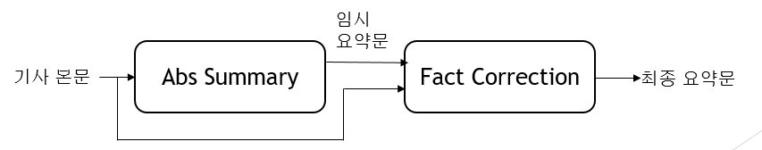
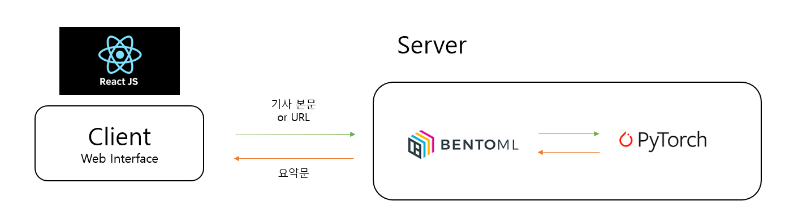

# Summarization_model_serving

## 요약 모델 개요

1. Abs Summary 모델을 통해 input으로 들어오는 기사 본문을 상황에 맞게 단어를 생성 또는 추출해 유연한 요약문을 만든다.

2. Fact Correction 모델은 Abs summary 모델을 통해 만들어진 요약문이 본문 내용과 다른 내용이 생성된 부분을 찾아 post-editing 방식으로 요약문을 수정한다.

## 요약모델 웹서비스

1. 요약모델을 Bentoml을 통해 serving한다.

2. Client들은 원하는 모드를 통해 요약 기사를 제공받을 수 있다.

## 참고 문헌
- BART: Denoising Sequence-to-Sequence Pre-training for Natural Language Generation, 		Translation, and Comprehension(2019, 10)
	
- Evaluating the Factual Consistency of Abstractive Text Summarization (Wojciech Kryściński, 	Bryan McCann, Caiming Xiong, Richard Socher) 

- Factual Error Correction for Abstractive Summarization Models (Meng Cao, Yue Dong, 		Jiapeng Wu, Jackie Chi Kit Cheung)
